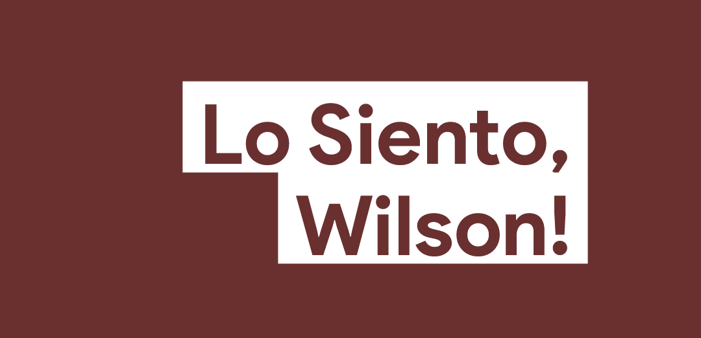

# Atlas Games (atlas.games)



A collection of high-performance, terminal-based games and generators built with Go and Bubble Tea.

## Games Included

### 1. Wilson's Revenge
Wilson the Chicken is back! A high-speed, horizontal terminal runner. Dodge cars, jump over barricades, and blast through enemies in this arcade classic.

### 2. Tactical Colony
A biological simulation engine. Manage an ant colony, forage for food, and avoid lethal territorial spiders.

### 3. Atlas Warlord
A tactical combat simulator. Command your units on the battlefield and outmaneuver the enemy.

### 4. Atlas Defense
A classic Tower Defense game. Defend the Atlas core from incoming data corruption by building tactical turrets. Manage your gold and health to survive increasingly difficult waves.

### 5. Atlas Void (New!)
An economy-driven space trader. Travel between planetary systems, trade commodities (Fuel, Food, Metal, Tech), and manage your ship's cargo and fuel to become the richest trader in the void.

### 6. WFC Generators
- **WFC Land Creator**: Procedural terrain generation using Wave Function Collapse.
- **WFC City Generator**: Urban layout generation using the same powerful algorithm.

## How to Play

### General Controls
- **Arrows / WASD**: Navigation
- **Enter / Space**: Select / Action
- **H**: Toggle Help (in-game)
- **R**: Reset Game
- **Q / Ctrl+C**: Quit to Menu / Exit

## Development

Built with Go and [Bubble Tea](https://github.com/charmbracelet/bubbletea).

### Running locally
```bash
go run main.go
```

### Building
```bash
# Use the gobake system
gobake build
```

## License
MIT
